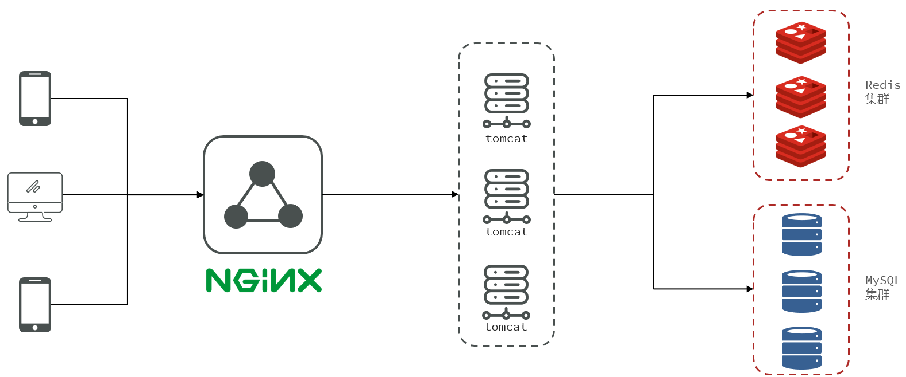

# 黑马点评

## 一.项目介绍

基于黑马点评所做的项目优化，实现基于session的session共享，解决商户缓存的缓存穿透缓存雪崩缓存击穿，基于redission分布式锁lua脚本消息队列实现异步秒杀下单，Redis的GEOHash来完成对于地理坐标的操作，使用Redis的BitMap数据实现签到统计，好友关注基于Set集合的关注取消关注共同关注等等功能，达人探店基于List来完成点赞列表的操作，Feed流推送博客基于SortedSet来完成点赞的排行榜功能，UV统计使用HyperLogLog
## 二.技术选型

Spring Boot 2.x Spring MVC 数据存储层：

MySQL：存储数据 MyBatis Plus：数据访问框架 Redis 相关：

spring-data-redis：操作 Redis Lettuce：操作 Redis 的高级客户端 Apache Commons Pool：用于实现 Redis 连接池 Redisson：基于 Redis 的分布式数据网格 工具库：

HuTool：工具库合集 Lombok：注解式代码生成工具

## 三.功能模块

### （1）短信登录
这一块我们会使用redis共享session来实现

### （2）商户查询缓存
通过本章节，我们会理解缓存击穿，缓存穿透，缓存雪崩等问题，让小伙伴的对于这些概念的理解不仅仅是停留在概念上，更是能在代码中看到对应的内容

### （3）优惠卷秒杀
通过本章节，我们可以学会Redis的计数器功能， 结合Lua完成高性能的redis操作，同时学会Redis分布式锁的原理，包括Redis的三种消息队列

### （4）附近的商户
我们利用Redis的GEOHash来完成对于地理坐标的操作

### （5）UV统计
主要是使用Redis来完成统计功能

### （6）用户签到
使用Redis的BitMap数据统计功能

### （7）好友关注
基于Set集合的关注、取消关注，共同关注等等功能，这一块知识咱们之前就讲过，这次我们在项目中来使用一下

### （8）打人探店
基于List来完成点赞列表的操作，同时基于SortedSet来完成点赞的排行榜功能


## 四.配置文件修改

 ```yml
    server:
    port: 8081
    spring:
      application:
        name: hmdp
      datasource:
        driver-class-name: com.mysql.cj.jdbc.Driver
        #    url: jdbc:mysql://127.0.0.1:3306/hmdp?useSSL=false&serverTimezone=UTC
        username: root
        password: 123456
        url: jdbc:mysql://localhost:3306/hmdp?serverTimezone=Asia/Shanghai&useUnicode=true&characterEncoding=utf-8&zeroDateTimeBehavior=convertToNull&useSSL=false&allowPublicKeyRetrieval=true
      redis:
        host: 192.168.8.130
        port: 6379
        password: yangroot
        lettuce:
          pool:
            max-active: 10
            max-idle: 10
            min-idle: 1
            time-between-eviction-runs: 10s
      jackson:
        default-property-inclusion: non_null # JSON处理时忽略非空字段
    mybatis-plus:
      type-aliases-package: com.hmdp.entity # 别名扫描包
    logging:
      level:
        com.hmdp: debug
      pattern:
        dateformat: mm:ss.SSS
   ```
## 五.项目演示

