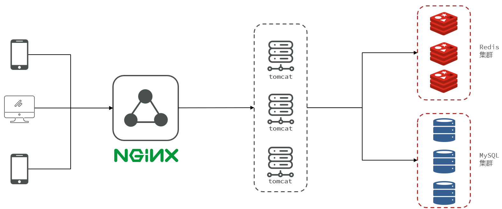

# 美食点评

## 一.项目介绍


一个基于 Spring Boot 的美食点评后台项目，提供用户登录、商家查询、附近商家、优惠券秒杀、探店笔记、关注互动和智能客服等能力。
项目使用 MySQL 保存核心业务数据，Redis 承担缓存、分布式 Session、地理位置、签到、关注关系和秒杀预校验等高频场景，RabbitMQ 用于秒杀订单异步处理，Redisson 用于分布式锁，Qwen + LangChain4j 用于智能客服和业务工具调用。

> 项目定位：学习和实践 Java 后端高并发、Redis 常用数据结构、缓存设计、异步消息和大模型业务接入。

## 一、项目功能

### 1. 用户登录

- 基于 Redis 实现分布式 Session。
- 支持验证码登录。
- Token 对应的用户信息保存到 Redis。
- 通过拦截器校验登录状态。
- 自动刷新 Token 有效期。
- 使用 `ThreadLocal` 保存当前请求用户上下文。

### 2. 商家查询

- 根据商家 ID 查询商家详情。
- 根据商家类型分页查询。
- 根据商家名称进行关键字查询。
- 商家详情使用 Redis 缓存。
- 数据库不存在的商家缓存空值，降低缓存穿透风险。
- 支持按经纬度查询附近商家。
- 附近商家基于 Redis GEO 实现。

### 3. 优惠券秒杀

- 查询商家优惠券。
- 发布和管理秒杀优惠券。
- Redis Lua 脚本完成库存判断和库存预扣。
- Lua 脚本校验用户是否重复购买。
- RabbitMQ 异步创建秒杀订单。
- Redisson 分布式锁控制同一用户的并发下单。
- MySQL 使用库存条件更新降低超卖风险。

### 4. 探店笔记

- 发布探店笔记。
- 查询热门笔记。
- 查询当前用户发布的笔记。
- 查询指定用户发布的笔记。
- 查询关注用户的 Feed 流。
- 支持笔记点赞和取消点赞。
- 支持笔记评论。

### 5. 关注与互动

- 关注用户。
- 取消关注。
- 判断是否关注。
- 查询共同关注。
- 基于 Redis Set 保存关注关系。
- 基于 Redis List 或 Set 保存点赞用户。
- 基于 Redis Sorted Set 实现点赞排行榜和 Feed 流排序。

### 6. 用户签到与 UV 统计

- 使用 Redis Bitmap 实现用户签到。
- 统计用户连续签到情况。
- 使用 HyperLogLog 统计独立访客数量。
- 使用 Redis GEO 查询附近商家。

### 7. 到家服务预约

- 用户可以创建到家服务预约。
- 支持查询当前用户预约记录。
- 支持用户取消预约。
- 支持预约幂等 Key。
- 智能客服可以通过 Function Calling 准备预约信息。
- 预约提交前需要用户确认。
- 商家确认、服务完成、商家拒绝和超时处理属于后续待优化功能。

### 8. 智能客服

- 接入通义千问 Qwen 大模型。
- 使用 LangChain4j 封装模型调用。
- 使用 Redis 保存聊天会话记忆。
- 支持按用户和会话隔离上下文。
- 支持 Function Calling 查询真实商家信息。
- 支持 Function Calling 准备和提交到家服务预约。
- 后端对模型传入的业务参数进行二次校验。
- 预约工具使用 Redis 保存待确认预约草稿。

## 二、技术栈

### 基础框架

- Java 17
- Spring Boot 2.3.12
- Spring MVC
- Spring Validation
- MyBatis-Plus 3.4.3
- Lombok
- Hutool

### 数据库与中间件

- MySQL：保存用户、商家、优惠券、订单、笔记、评论和预约数据。
- Redis：实现缓存、登录 Session、Lua、GEO、Bitmap、Set、Sorted Set、HyperLogLog 和分布式协调。
- Lettuce：Redis 客户端。
- Redisson：分布式锁和 Redis 高级能力。
- RabbitMQ：秒杀订单异步处理。
- Commons Pool：Redis 连接池。

### AI 能力

- Qwen / DashScope：大模型服务。
- LangChain4j：Java 大模型应用框架。
- Redis Chat Memory：保存会话记忆。
- Function Calling：查询商家和创建预约。

### 当前未接入的规划能力

以下能力属于后续优化方向，目前不能视为已经完整实现：

- Caffeine 本地缓存。
- Elasticsearch 商家搜索。
- Micrometer / Prometheus 业务监控。
- TraceId 链路追踪。
- RabbitMQ 完整重试和死信机制。
- 秒杀库存回补和预扣超时补偿。

## 三、项目架构

项目整体采用 Controller、Service、Mapper、Entity 分层结构。

```text
com.hmdp
├── controller                 普通业务接口
├── service                    业务服务接口
├── service.impl               业务服务实现
├── mapper                     MyBatis-Plus Mapper
├── entity                     数据库实体
├── dto                        接口数据传输对象
├── utils                      Redis、登录、锁和通用工具
├── config                     Spring、MyBatis、RabbitMQ、Redisson 配置
├── listener                   RabbitMQ 消费者
├── appointment                到家服务预约模块
└── ai                         智能客服、会话记忆和业务工具
```

资源文件结构：

```text
src/main/resources
├── application.yaml
├── application-dev.yaml
├── application-test.yaml
├── application-prd.yaml
├── db/hmdp.sql
├── db/ai_customer_service.sql
├── seckill.lua
├── unlock.lua
└── mapper/
```

## 四、核心业务流程

### 1. 用户登录流程

```text
用户输入手机号
        ↓
生成验证码
        ↓
验证码写入 Redis
        ↓
用户提交验证码
        ↓
校验验证码
        ↓
查询或创建用户
        ↓
生成 Token
        ↓
用户信息写入 Redis
        ↓
后续请求携带 Token
        ↓
拦截器读取 Redis 并刷新 Token 有效期
```

主要 Redis Key：

```text
login:code:{phone}
login:token:{token}
```

### 2. 商家详情查询流程

```text
请求商家详情
        ↓
查询 Redis 商家缓存
        ↓ 命中
直接返回
        ↓ 未命中
查询 MySQL
        ↓
查询到数据后写入 Redis
        ↓
返回商家详情
```

当前项目采用 Cache Aside 缓存策略：

- 查询时先查缓存。
- 缓存未命中时查询数据库。
- 查询成功后写入缓存。
- 更新数据库成功后删除 Redis 缓存。
- 数据不存在时缓存空值，防止重复查询数据库。

### 3. 附近商家查询流程

```text
用户提交经纬度和商家类型
        ↓
Redis GEO 查询附近商家 ID 和距离
        ↓
根据商家 ID 查询详情
        ↓
按照 GEO 返回顺序组装结果
        ↓
返回商家列表
```

Redis GEO 主要保存商家 ID 和坐标，商家完整数据仍然以 MySQL 为准。

### 4. 秒杀下单流程

```text
用户发起秒杀请求
        ↓
Redis Lua 原子校验库存
        ↓
校验用户是否重复购买
        ↓
Redis 预扣库存
        ↓
生成订单 ID
        ↓
发送 RabbitMQ 消息
        ↓
接口快速返回
        ↓
RabbitMQ 消费者异步处理订单
        ↓
Redisson 控制同一用户并发下单
        ↓
MySQL 条件扣减库存
        ↓
创建秒杀订单
```

数据库库存扣减核心 SQL：

```sql
UPDATE tb_seckill_voucher
SET stock = stock - 1
WHERE voucher_id = ?
  AND stock > 0;
```

当前秒杀链路已经具备 Redis Lua、RabbitMQ 异步下单和数据库库存条件更新基础。

但是以下能力仍属于待优化项：

- RabbitMQ Publisher Confirm。
- RabbitMQ 重试队列。
- RabbitMQ 死信队列。
- 消费失败后的可靠重试。
- Redis 预扣库存确认。
- 订单失败后的库存回补。
- 预扣库存超时扫描。
- 秒杀订单联合唯一索引。
- Redis Stream 与 RabbitMQ 双通道问题处理。

### 5. 探店笔记和 Feed 流

```text
用户发布笔记
        ↓
笔记主体写入 MySQL
        ↓
用户关注关系保存到 Redis
        ↓
发布内容推送到粉丝 Feed
        ↓
粉丝通过 Sorted Set 按时间滚动查询
```

主要设计：

- MySQL 保存笔记主体。
- Redis 保存点赞、关注和 Feed 数据。
- Sorted Set 保存 Feed 流和热门排序。
- List 或 Set 保存点赞用户。
- Set 实现共同关注查询。

### 6. 到家服务预约流程

```text
用户提交预约信息
        ↓
校验商家是否存在
        ↓
校验预约时间
        ↓
校验联系人、联系电话和地址
        ↓
生成预约草稿或预约订单
        ↓
用户确认
        ↓
预约写入 MySQL
        ↓
用户可以查询或取消预约
```

当前预约已支持：

- 创建预约。
- 查询我的预约。
- 用户取消预约。
- 幂等 Key 防止重复创建。
- AI 会话中的预约确认。

待优化：

- 商家确认预约。
- 商家拒绝预约。
- 服务完成。
- 预约超时。
- 状态流转日志。
- 状态变更权限校验。

### 7. 智能客服流程

```text
用户发送问题
        ↓
根据用户 ID 和会话 ID 获取 Redis 会话记忆
        ↓
调用 Qwen
        ↓
模型判断是否需要调用工具
        ↓
后端执行商家查询或预约工具
        ↓
工具结果返回模型
        ↓
模型生成自然语言回答
        ↓
保存新的聊天消息
```

模型只负责理解意图和生成工具参数，不能直接访问数据库。

后端工具负责：

- 查询真实商家信息。
- 校验商家是否存在。
- 准备到家服务预约。
- 校验预约时间和联系方式。
- 获取当前登录用户。
- 创建最终预约订单。

## 五、Redis 数据结构设计

| 业务场景 | Redis 数据结构 | 作用 |
| --- | --- | --- |
| 商家详情缓存 | String | 保存商家 JSON |
| 登录 Session | String / Hash | 保存 Token 对应用户 |
| 商家地理位置 | GEO | 查询附近商家 |
| 用户签到 | Bitmap | 记录每天是否签到 |
| 关注关系 | Set | 关注、取关和共同关注 |
| 点赞用户 | List / Set | 保存点赞用户 |
| 热门笔记 | Sorted Set | 按热度排序 |
| Feed 流 | Sorted Set | 按时间滚动查询 |
| UV 统计 | HyperLogLog | 统计独立访客 |
| 秒杀库存 | String | 保存 Redis 库存 |
| 秒杀购买资格 | Set | 判断一人一单 |
| 分布式锁 | String / Redisson | 控制并发操作 |
| AI 会话记忆 | String | 保存聊天历史 |
| AI 预约草稿 | String | 保存待确认预约 |

## 六、数据库设计

主要业务表：

| 表名 | 说明 |
| --- | --- |
| `tb_user` | 用户信息 |
| `tb_user_info` | 用户扩展信息 |
| `tb_shop` | 商家信息 |
| `tb_shop_type` | 商家类型 |
| `tb_voucher` | 优惠券 |
| `tb_seckill_voucher` | 秒杀优惠券和库存 |
| `tb_voucher_order` | 优惠券订单 |
| `tb_blog` | 探店笔记 |
| `tb_blog_comments` | 笔记评论 |
| `tb_follow` | 用户关注关系 |
| `tb_sign` | 用户签到 |
| `tb_home_service_appointment` | 到家服务预约 |

初始化 SQL：

```text
src/main/resources/db/hmdp.sql
src/main/resources/db/ai_customer_service.sql
```

## 七、主要接口

### 用户接口

| 方法 | 路径 | 说明 |
| --- | --- | --- |
| POST | `/user/code` | 获取验证码 |
| POST | `/user/login` | 用户登录 |
| POST | `/user/logout` | 用户退出 |
| GET | `/user/me` | 查询当前用户 |
| POST | `/user/sign` | 用户签到 |
| GET | `/user/sign/count` | 查询签到统计 |

### 商家接口

| 方法 | 路径 | 说明 |
| --- | --- | --- |
| GET | `/shop/{id}` | 查询商家详情 |
| POST | `/shop` | 新增商家 |
| PUT | `/shop` | 修改商家 |
| GET | `/shop/of/type` | 按类型查询商家 |
| GET | `/shop/of/name` | 按名称查询商家 |

### 优惠券接口

| 方法 | 路径 | 说明 |
| --- | --- | --- |
| POST | `/voucher` | 新增优惠券 |
| POST | `/voucher/seckill` | 新增秒杀优惠券 |
| GET | `/voucher/list/{shopId}` | 查询商家优惠券 |
| POST | `/voucher-order/seckill/{id}` | 秒杀优惠券 |

### 探店和社交接口

| 方法 | 路径 | 说明 |
| --- | --- | --- |
| POST | `/blog` | 发布笔记 |
| PUT | `/blog/like/{id}` | 点赞或取消点赞 |
| GET | `/blog/hot` | 查询热门笔记 |
| GET | `/blog/of/follow` | 查询关注 Feed |
| PUT | `/follow/{id}/{isFollow}` | 关注或取消关注 |
| GET | `/follow/or/not/{id}` | 判断是否关注 |
| GET | `/follow/common/{id}` | 查询共同关注 |
| POST | `/blog-comments` | 发布评论 |

### 预约和 AI 接口

| 方法 | 路径 | 说明 |
| --- | --- | --- |
| POST | `/appointments/home-service` | 创建到家服务预约 |
| GET | `/appointments/home-service/me` | 查询我的预约 |
| PUT | `/appointments/home-service/{id}/cancel` | 用户取消预约 |
| POST | `/ai/chat` | 智能客服对话 |
| DELETE | `/ai/chat/conversations/{conversationId}` | 删除聊天会话 |

## 八、缓存设计

### Cache Aside

当前商家详情缓存采用 Cache Aside：

```text
查询：
Redis → 未命中 → MySQL → 回填 Redis

更新：
MySQL → 删除 Redis
```

MySQL 是最终数据源，Redis 只负责提高读取性能。

### 缓存穿透

当前通过缓存空对象降低缓存穿透风险：

```text
查询不存在的商家
        ↓
查询 MySQL
        ↓
结果为空
        ↓
Redis 缓存空值
        ↓
后续请求直接返回不存在
```

后续可以进一步增加：

- 参数校验。
- 布隆过滤器。
- 随机 ID 限流。
- 空值 TTL 随机化。

### 缓存击穿

项目中保留了逻辑过期和互斥锁重建缓存的实现思路。

后续可以进一步完善：

- 热点商家预热。
- 缓存重建线程池。
- 分布式锁安全释放。
- 缓存重建失败重试。

### 缓存雪崩

当前缓存 TTL 固定，后续计划增加随机 TTL：

```text
最终 TTL = 基础 TTL + 随机 TTL
```

同时评估：

- Caffeine 本地缓存。
- 本地缓存失效广播。
- 缓存失效消息通知。
- 定时缓存校正。

## 九、智能客服设计

### 会话记忆

会话 Key 可以按照用户 ID 和会话 ID 隔离：

```text
chat:memory:{userId}:{conversationId}
```

会话记录设置最大消息数和过期时间，避免上下文无限增长。

### Function Calling

Function Calling 流程：

```text
用户提出问题
        ↓
模型判断是否需要调用工具
        ↓
模型生成工具名称和参数
        ↓
后端执行工具
        ↓
后端校验参数和权限
        ↓
工具结果返回模型
        ↓
模型生成最终回答
```

模型不能直接访问数据库，所有业务查询和写操作必须由后端工具完成。

### 预约安全

预约工具需要校验：

- 用户是否登录。
- 商家是否存在。
- 预约时间是否晚于当前时间。
- 联系电话格式。
- 服务地址是否为空。
- 用户确认状态。
- 幂等 Key。

### 待完善能力

智能客服后续需要补充：

- Redis 限流。
- 敏感词过滤。
- Prompt Injection 防护。
- AI 调用审计日志。
- 手机号和地址脱敏。
- Qwen 超时降级 FAQ。
- AI 调用耗时和失败率监控。

## 十、配置说明

公共配置位于：

```text
src/main/resources/application.yaml
```

环境配置位于：

```text
src/main/resources/application-dev.yaml
src/main/resources/application-test.yaml
src/main/resources/application-prd.yaml
```

建议使用环境变量配置数据库、Redis、RabbitMQ 和 Qwen，不要把生产密码和 API Key 提交到代码仓库。

### 常用配置示例

```yaml
spring:
  profiles:
    active: dev

ai:
  qwen:
    enabled: false
    api-key: ${QWEN_API_KEY:}
    model-name: qwen-plus
    timeout-seconds: 30
  chat:
    memory-max-messages: 40
    memory-ttl-hours: 24
```

### 开发环境变量

```text
SPRING_PROFILES_ACTIVE=dev

DEV_DB_URL=jdbc:mysql://localhost:3306/hmdp
DEV_DB_USERNAME=root
DEV_DB_PASSWORD=******

DEV_REDIS_HOST=localhost
DEV_REDIS_PORT=6379
DEV_REDIS_PASSWORD=******

DEV_RABBITMQ_HOST=localhost
DEV_RABBITMQ_PORT=5672
DEV_RABBITMQ_VIRTUAL_HOST=/
DEV_RABBITMQ_USERNAME=guest
DEV_RABBITMQ_PASSWORD=guest

QWEN_ENABLED=true
QWEN_API_KEY=******
QWEN_MODEL_NAME=qwen-plus
```

## 十一、快速启动

### 1. 环境要求

- JDK 17+
- Maven 3.8+
- MySQL 8.x 或兼容版本
- Redis 6.x+
- RabbitMQ 3.x+

### 2. 创建数据库

```sql
CREATE DATABASE hmdp
DEFAULT CHARACTER SET utf8mb4
COLLATE utf8mb4_general_ci;
```

### 3. 初始化表结构

依次执行：

```text
src/main/resources/db/hmdp.sql
src/main/resources/db/ai_customer_service.sql
```

### 4. 启动基础设施

启动以下服务：

- MySQL
- Redis
- RabbitMQ

并确保配置文件中的地址、端口、用户名和密码可以正常访问。

### 5. 启动项目

```bash
mvn spring-boot:run
```

或：

```bash
mvn clean package
java -jar target/hm-dianping-0.0.1-SNAPSHOT.jar
```

默认端口：

```text
http://localhost:8081
```

### 6. 编译和测试

```bash
mvn -q -DskipTests compile
mvn test
```

部分测试依赖 MySQL、Redis 等外部服务，执行前请确认测试配置和基础设施已经准备好。

## 十二、测试现状

当前已有少量测试，主要覆盖：

- Redis ID 生成器并发测试。
- HyperLogLog 基础测试。
- 商家 GEO 数据加载测试。
- AI 未登录校验。
- AI 会话 ID 和用户隔离。
- AI 预约确认上下文清理。

后续需要补充：

- Lua 库存充足和库存不足测试。
- Lua 一人一单测试。
- RabbitMQ 重试和死信集成测试。
- 消费者重复消费幂等测试。
- Redis 预扣库存回补测试。
- 预扣库存超时测试。
- 缓存击穿和缓存重建测试。
- 预约状态机测试。
- AI 限流和敏感词过滤测试。
- FAQ 降级测试。
- 秒杀接口高并发压测。
- AI 接口超时和限流压测。

## 十三、项目待优化方向

详细计划见：

[美食点评项目待优化功能清单.md](docs/美食点评项目待优化功能清单.md)

### P0：秒杀稳定性和数据安全

- RabbitMQ 重试队列和死信队列。
- 消费失败不能吞异常。
- RabbitMQ Publisher Confirm 和 Return。
- 消除 Redis Stream 与 RabbitMQ 双通道重复投递。
- 增加秒杀订单联合唯一索引。
- 增加 Redis 预扣库存记录。
- 增加库存回补机制。
- 增加预扣库存超时扫描。

### P1：缓存、搜索和核心业务完善

- 缓存 TTL 增加随机值。
- 引入 Caffeine 本地缓存。
- 增加本地缓存失效广播。
- 完善缓存和数据库一致性策略。
- 评估和接入 Elasticsearch 商家搜索。
- 完善预约状态机。
- 统一重要写接口幂等设计。

### P2：AI 安全、监控和测试体系

- 智能客服限流。
- 敏感词和 Prompt Injection 过滤。
- AI 审计日志。
- FAQ 降级。
- TraceId 链路追踪。
- 业务监控指标和告警。
- 单元测试。
- 集成测试。
- 高并发压测。

## 十四、ThreadLocal 使用注意事项

项目通过 `UserHolder` 保存当前请求用户，但 ThreadLocal 只能作为请求上下文工具，不能代替 Redis Session 或 Token。

使用 ThreadLocal 时需要注意：

- 请求结束后必须通过 `finally` 或拦截器统一调用 `remove`。
- 线程池复用时如果不清理，可能导致用户信息串号。
- ThreadLocalMap 的弱引用 Key 和强引用 Value 可能导致内存泄漏。
- `@Async`、线程池和 RabbitMQ 消费线程不会自动继承当前 ThreadLocal。
- 异步任务优先显式传递 `userId`。
- 只保存轻量用户信息，不要保存 Request、Response、文件和大集合。
- 订单、预约、优惠券等关键业务仍然要重新校验数据归属和操作权限。

## 十五、项目面试总结

可以这样介绍项目：

> 这是一个基于 Spring Boot 的美食点评平台，主要实现了用户登录、商家查询、附近商家、优惠券秒杀、探店笔记、关注互动和智能客服等功能。项目使用 MySQL 保存核心业务数据，Redis 解决缓存、分布式 Session、GEO、签到、关注关系和秒杀高并发问题，RabbitMQ 对秒杀订单进行异步削峰，Redisson 处理分布式锁。新增的智能客服使用 Qwen 和 LangChain4j，通过 Redis 保存会话记忆，并使用 Function Calling 查询商家和处理到家服务预约。项目重点实践了缓存设计、Lua 原子操作、异步消息、幂等控制和大模型与传统业务系统的结合。

项目核心技术职责：

```text
MySQL
负责业务数据最终持久化和事务一致性

Redis
负责缓存、Session、秒杀预校验和高频数据结构

RabbitMQ
负责秒杀订单异步削峰和业务解耦

Redisson
负责分布式锁和跨实例并发控制

Qwen
负责自然语言理解和回答生成

LangChain4j
负责 AI Service、会话记忆和 Function Calling 编排
```

## 十六、项目目录

```text
D:\AIPro\hmdp
├── src
│   ├── main
│   │   ├── java
│   │   └── resources
│   └── test
├── assert
├── pom.xml
├── README.md
├── Conclusion.MD
└── 美食点评项目待优化功能清单.md
```

## 十七、相关文档

- [项目待优化功能清单](docs/美食点评项目待优化功能清单.md)
- [数据库初始化脚本](src/main/resources/db/hmdp.sql)
- [智能客服数据库脚本](src/main/resources/db/ai_customer_service.sql)
- [项目总结](Conclusion.MD)